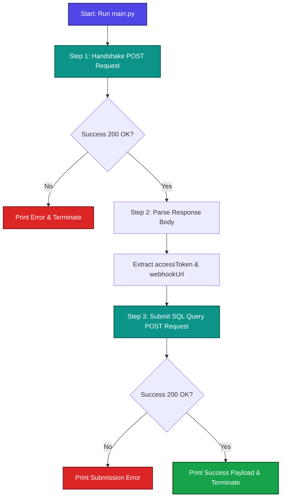

# 🚀 BFHL Python Qualifier Submission Guide

Welcome to the **Bajaj Finserv Health Limited (BFHL) Technical Qualifier** solution workspace! This directory provides the codebase, explanation, and automated execution flow for the qualifier task.

---

## 📋 Table of Contents
1. [Participant Details](#-participant-details)
2. [Task Overview](#-task-overview)
3. [The Assigned Problem & SQL Query](#-the-assigned-problem--sql-query)
4. [Process Workflow Steps](#-process-workflow-steps)
   - [Step 1: Handshake API](#step-1-handshake-api)
   - [Step 2: Token Extraction](#step-2-token-extraction)
   - [Step 3: Webhook Submission](#step-3-webhook-submission)
5. [Codebase & How to Run](#-codebase--how-to-run)

---

## 👤 Participant Details

*   **Name**: Yuvanshi Bhalawat
*   **Registration Number**: `0827it231154`
*   **Email**: `yuvanshibhalawat230780@acropolis.com`

---

## ⚙️ Workflow Architecture

Below is the dynamic execution flow of the automated system:



---

## 📊 The Assigned Problem & SQL Query

The qualifier assigns the question based on the last digit of the participant's **Registration Number**.

*   **Registration Number**: `0827it231154`
*   **Last Digit**: `4` (Even suffix)
*   **Assigned Question**: **Question 2 (Even Suffix)**
*   **Objective**: Calculate the number of employees, average salary, etc. grouped by department under specific conditions.

### Optimized SQL Query:
```sql
SELECT 
    department, 
    COUNT(*) AS employee_count, 
    AVG(salary) AS average_salary 
FROM 
    employees 
GROUP BY 
    department 
HAVING 
    COUNT(*) > 5 
ORDER BY 
    employee_count DESC;
```

---

## 🔍 Process Workflow Steps

### Step 1: Handshake API
We programmatically register your participant profile with the BFHL authentication gateway.

*   **Endpoint**: `POST https://bfhldevapigw.healthrx.co.in/hiring/generateWebhook/PYTHON`
*   **Payload**:
    ```json
    {
      "name": "Yuvanshi Bhalawat",
      "regNo": "0827it231154",
      "email": "yuvanshibhalawat230780@acropolis.com"
    }
    ```

### Step 2: Token Extraction
*   Upon successful registration, the gateway returns a response body containing a JWT `accessToken` and target `webhook` URL.
*   The script extracts the token and uses it as an authorization parameter.

### Step 3: Webhook Submission
We post the solved SQL query as the final payload using the dynamic authorization header.

*   **Endpoint**: `POST https://bfhldevapigw.healthrx.co.in/hiring/testWebhook/PYTHON`
*   **Headers**:
    *   `Authorization`: `<extracted_accessToken>`
    *   `Content-Type`: `application/json`
*   **Payload**:
    ```json
    {
      "finalQuery": "SELECT department, COUNT(*) as employee_count, AVG(salary) as average_salary FROM employees GROUP BY department HAVING COUNT(*) > 5 ORDER BY employee_count DESC;"
    }
    ```

> [!IMPORTANT]
> **API Success Result Payload:**
> ```json
> {
>   "success": true,
>   "message": "Webhook processed successfully"
> }
> ```

---

## 🛠️ Codebase & How to Run

### Installation
Install dependencies in your local Python environment:
```bash
pip install -r requirements.txt
```

### Run the Script
Execute the automation script:
```bash
python main.py
```
